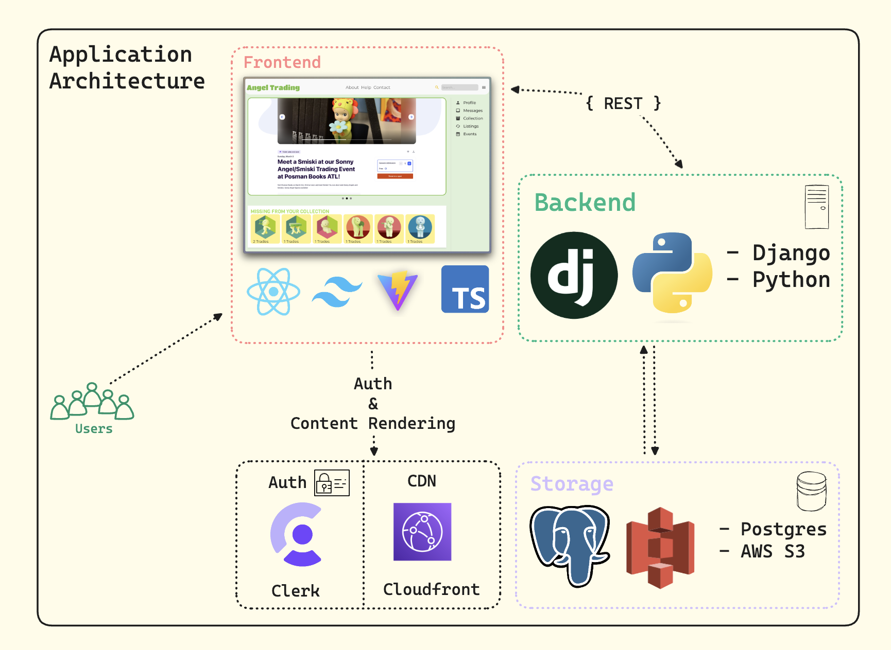

  <h1>
    <a href="https://angel-trading-company.com/">
      Angel Trading Co.
    </a>
  </h1>

## Introduction

Angel Trading Co. is a project that seeks to streamline the buying, selling, and trading experience of collectors within the Smiski community. Due to the absence of a dedicated communication hub, we aspire to provide avid collectors, trade enthusiasts, and newcomers a platform where they can immerse themselves in a culture of like-minded individuals. Currently, we are focused on supporting Smiski communities but are looking to broaden our service to other collectibles!

## Web Application Link
https://angel-trading-company.com/

## Core User Features
1. Trading / Selling / Buying Smiski Collectibles
2. Smiski Verification for Authenticity
3. User-Curated Recommendations
4. Local Events and Meet-ups: Keep in touch with your local community by staying in the loop of all relevant events hosted by authorized retailers!
5. Customizable Profile
6. Chat: Discuss with other users to finalize exchange details or make some new friends!
7. User Collection and Wishlist: Keep track of your collection and identify which figures you are actively seeking with shareable links.
8. Saved Listings: Compare offers or take time to ponder listings by saving them all in one place. 
9. Help and Contact Us: For questions or concerns, the Help page offers an FAQ to address them quickly, but feel free to contact the team for other inquries.

## Application Architecture

Our application is divided into two main components: frontend and backend. For the frontend, we are currently using React, Vite, Typescript, and Tailwind CSS. For the backend, we are using the Django framework with Python. Additionally, we are using Postgres SQL as our database and AWS S3 with AWS Cloudfront for media storage. We are also using Clerk for user authentication and GPT-4 Vision API for image recognition and classification.

## Found an issue?

If you have found an issue with the quickstart, please create an [issue](https://github.com/AustinWheel/angel-trading-co/issues).

If it's a quick fix, such as a misspelled word or a broken link, feel free to skip creating an issue.  
Go ahead and create a [pull request](https://github.com/clerkinc/clerk-nextjs-app-quickstart/pulls) with the solution.

## Want to leave feedback?

Feel free to create an [issue](https://github.com/AustinWheel/angel-trading-co/issues) with the **feedback** label. Our team will take a look at it and get back to you as soon as we can!
